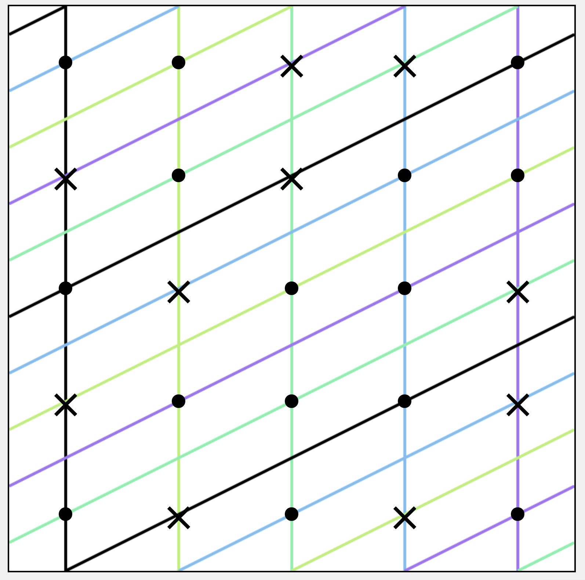

Visualizer for a talk given at the Recurse Center about equidistribution. Allows you to select points, draw lines, and draw collections of parallel lines.

Written at the Recurse Center in late 2025.

