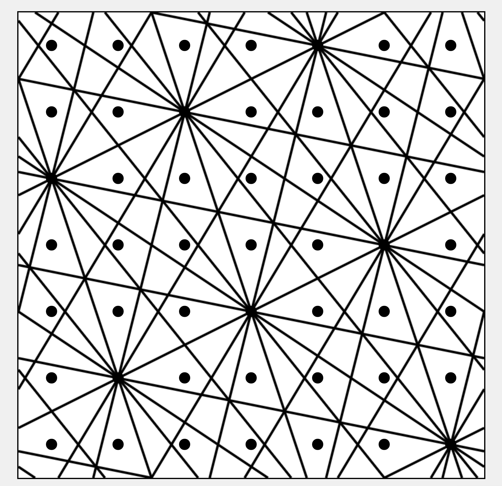

Visualizer for a talk given at the Recurse Center about equidistribution. Allows you to select points, draw lines, and draw collections of parallel lines.

Check it out here: [5x5](https://equidistribution-visualizer.onrender.com/?grid=5) [7x7](https://equidistribution-visualizer.onrender.com/?grid=7) [11x11](https://equidistribution-visualizer.onrender.com/?grid=11)

Written at the Recurse Center in late 2025.

  
  

  
  

